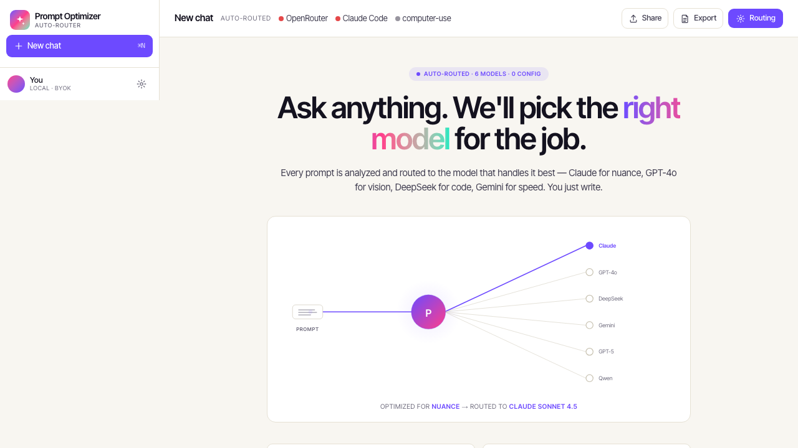
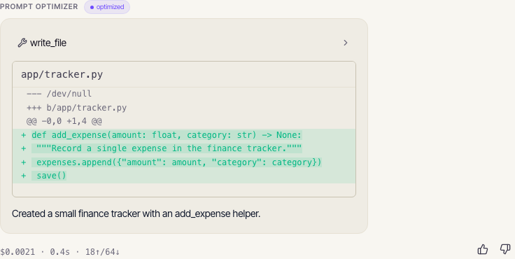
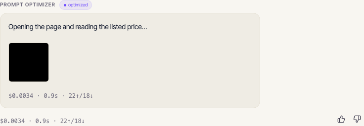

# Prompt Optimizer

**No more manual model picking.** You type into a single chat box; Prompt Optimizer
silently routes each prompt to the model or agent best suited to answer it — and shows you
*why*. Conversational questions go to Claude / GPT-5 / Gemini via OpenRouter; build-and-edit
coding tasks go to the Claude Code SDK; browse-and-act tasks go to Anthropic computer-use.
The response streams back, and routing stays quietly out of your way: a subtle **optimized**
pill above each answer reveals the full *"Routed to X — because Y"* rationale on hover or
focus (and to screen readers). Quality first; cost is only a tiebreaker.



It is bring-your-own-keys and runs entirely on your machine — no hosted backend, no shared
infrastructure, no accounts. Your keys never leave your local instance.

Two stacks live in this repo:

- **Chat app** (`apps/`) — FastAPI back-end (Python, loads the routing models in-process) +
  Next.js front-end (TypeScript, App Router, AI SDK UI Message Stream + assistant-ui). This
  is the product: the auto-routing chat UI.
- **Routing brain** (`src/`) — the Python scikit-learn pipeline that trains the calibrated
  task-type classifier, the agentic-intent head, and the model router, and exposes a
  framework-free `decide(prompt, history, artifacts, settings) -> RoutingDecision` callable.
  See [How the routing brain is built](#how-the-routing-brain-is-built--retraining-the-router)
  near the end if you want to retrain it.

---

## Quickstart — run the chat app in under 10 minutes

> This is the exact path we measure for the fresh-clone UAT, end to end:
> `git clone` → `make setup` → paste your OpenRouter key → `make dev` → click a sample
> prompt → first streamed answer.
>
> **tested on 2026-05-27 · macOS 26.3.2 (Darwin 25.3) · ~2.8 s from `make dev` to first stream** —
> measured warm (deps already installed, fake-adapter path). The full **cold-clone** onboarding
> time (incl. the one-time `make setup`, which dominates) is **not yet measured** on a clean
> machine with a real key; a maintainer cold-cache run will replace this with the real
> `git clone → first stream` figure.
> <!-- OSS-08 status: runtime-to-first-stream measured (~2.8 s, warm env / fake-adapter pipeline).
>      The cleared-caches fresh-clone onboarding number (SC#4: <10 min from a clean machine with a
>      real OpenRouter key) is still PENDING a maintainer run — see
>      .planning/phases/06-open-source-release-hardening/06-05-SUMMARY.md. -->

**Prerequisites:** `git` + `git-lfs`, [`uv`](https://docs.astral.sh/uv/), Node 18+ with
[`pnpm`](https://pnpm.io/) (try `corepack enable pnpm`), and GNU `make` (optional — you can
run the scripts directly). macOS and Linux are supported directly; **Windows users run this
inside WSL** (the setup scripts assume a POSIX shell — there is no PowerShell variant).

```bash
# 1. Clone
git clone <your-fork-or-this-repo-url> prompt-optimizer
cd prompt-optimizer

# 2. Provision both stacks (Python env + NLTK data + web deps + Chromium + .env files).
#    Fail-fast and idempotent — safe to re-run.
make setup

# 3. Paste your OpenRouter key into the .env that step 2 created.
#    Open .env and set:  OPENROUTER_API_KEY=sk-or-...
#    (You can also enter it in the in-app first-run modal — see step 5.)

# 4. Launch FastAPI (:8000) + Next.js (:3000) together. Ctrl-C stops both.
make dev

# 5. Open http://localhost:3000, enter your OpenRouter key in the first-run
#    modal if you skipped step 3, then click a sample prompt — the routing chip,
#    streamed markdown, and a cost/latency/token footer should appear.
```

`make setup` provisions **both** sides so you are not stuck before the first prompt: it runs
`git lfs install` (it does **not** pull the training CSVs — those are only needed for
retraining), `uv sync --locked`, prefetches the NLTK tokenizer data, runs
`pnpm --dir apps/web install`, installs the Playwright Chromium browser, and copies
`.env.example` → `.env` (and `apps/web/.env.example` → `apps/web/.env`) if they are absent.

**Make-less environments:** the logic lives in portable shell scripts — run
`./scripts/setup.sh` and `./scripts/dev.sh` directly if you do not have `make`.

**Two-terminal fallback** (instead of `make dev`):

```bash
# Terminal 1 — FastAPI back-end
uv run uvicorn apps.api.main:app --port 8000

# Terminal 2 — Next.js front-end (pin the IPv4 upstream; see apps/web/.env.example)
( cd apps/web && FASTAPI_URL=http://127.0.0.1:8000 pnpm dev --port 3000 )
```

The Next side reads its FastAPI upstream URL from **`apps/web/.env.example`** (the
`FASTAPI_URL` variable — server-only, never exposed to the browser). Pin the literal
`127.0.0.1` rather than `localhost`: Node resolves `localhost` to `::1` first, but uvicorn
binds IPv4, so an unpinned upstream fetch silently fails.

Want just the offline routing CLI (no chat UI)? See
[How the routing brain is built](#how-the-routing-brain-is-built--retraining-the-router).

---

## The golden path — three prompts, three backends

Prompt Optimizer's whole thesis is that *the same chat box* sends each of these three fixed
prompts to a different backend automatically. Paste each one and watch where it routes — the
answer's shape, plus a subtle **optimized** pill, tells you which backend ran:

### 1. "Build me a small finance tracker app" → Claude Code

A build-and-edit coding task routes to the **Claude Code SDK**. The bubble shows the agent's
tool calls and a red/green file diff; the quiet **optimized** pill sits above it — hover or
focus it for the full `Routed to Claude Code — build-and-edit task` rationale.



### 2. "What is the capital of France?" → OpenRouter

A conversational question routes to a chat model via **OpenRouter** and streams a markdown
answer below the same **optimized** pill.


### 3. "Open this URL and check the price" → computer-use

A browse-and-act task routes to **Anthropic computer-use**, which drives a browser and shows
a screenshot strip below the **optimized** pill. (Computer-use is **off by default** — see
[Security & Safety](#security--safety) before you enable it.)



Routing is invisible-by-default — the pill stays out of your way — but the full
`Routed to <model-or-agent> — <reason>` is always one hover (or screen-reader focus) away,
and the answer's shape already signals the backend: a chat reply, a code diff, or a browser
screenshot strip. You never pick a model by hand.

---

## Security & Safety

> ⚠️ **Treat computer-use like running untrusted code against your browser session — don't
> enable it on a machine with sensitive logged-in sessions or files you can't afford to
> expose.**

Computer-use lets an Anthropic agent drive a real browser on your machine: it reads page
content and takes actions (click, type, navigate). That is powerful and genuinely risky, so
it ships **off by default** behind a strict double opt-in, with several built-in caps. This
section documents the three main threats, the guard already built for each, and the
responsibility that remains yours.

### Computer-use is OFF unless you turn it on **twice**

Computer-use runs **only when BOTH** of these are set — this is a strict AND, not an either/or:

1. The environment variable **`COMPUTER_USE_OPT_IN=1`** (it defaults to `0` on a fresh
   clone), **AND**
2. The **in-app settings toggle** for computer-use is switched on.

Setting one without the other does **not** enable computer-use. Both gates must be on at the
same time. (Enforced in `apps/api/settings.py` — `return env_ok and setting_ok` — and again
at the turn and adapter layers.)

### Threat → built-in mitigation → your responsibility

| Threat | Built-in mitigation (already shipped) | Your responsibility |
|--------|----------------------------------------|---------------------|
| **Prompt injection from visited pages** — a page the agent reads may contain adversarial instructions trying to hijack the session | 15-step cap on computer-use turns (`apps/api/backends/computer_use/step_counter.py`), the `$0.50` per-turn cost cap (`apps/api/backends/cost.py`), a per-turn ephemeral throwaway workspace, and the STRICT-AND double opt-in above | **Don't enable computer-use on a machine with sensitive logged-in browser sessions** (email, banking, internal tools) or files you can't afford to expose. |
| **Runaway cost** — an agent loop or a long stream burning through your provider credit | `$0.50` per-turn USD cost cap (BACKEND-06, `apps/api/backends/cost.py`) plus step caps of **25** for Claude Code (`apps/api/backends/claude_code/step_counter.py`) and **15** for computer-use (`apps/api/backends/computer_use/step_counter.py`) | **Monitor your BYOK provider spend.** The cap is **per turn, not per day** — many turns still add up. Set provider-side budget alerts. |
| **Workspace exfiltration** — an agent reading or writing files on your disk | Each turn runs in a **fresh, throwaway temp workspace** (`tempfile.mkdtemp(prefix="pomu-cc-")`, `apps/api/backends/claude_code/workspace.py`); the agent gets that empty dir unless you opt in to point it at your own repo `cwd` | **Keep the opt-in `cwd` flag OFF unless you trust the prompt.** Only point the agent at your real working directory when you are confident the prompt is benign. |

**About the workspace, precisely (what ships today):** every coding/agent turn runs with
`cwd=None`, which means a **fresh `tempfile.mkdtemp(prefix="pomu-cc-")` throwaway directory
created per turn** and cleaned up after — so each turn is isolated by default. The documented
home root for per-thread workspaces is `~/.prompt-optimizer/workspaces/<thread_id>/`
(`apps/api/paths.py`); pointing the agent at your own repository `cwd` is an explicit opt-in,
not the default.

### Broader trust model

Two more things are worth understanding before you run or contribute to this repo:

- **`joblib.load` is a code-trust boundary.** The routing models are committed `.joblib`
  files (regular git objects — only the training CSVs use Git LFS). Loading a `.joblib`
  **executes pickled Python code** (`joblib.load` at `src/routing/decide.py:128`). The trust
  boundary is therefore "the contributor who pushed the model last." Because the models are
  ordinary git objects, they are reviewable in pull requests — review model changes the same
  way you review code.
- **BYOK key handling.** You bring your own OpenRouter / Anthropic keys. They live in
  **process memory** (with an optional OS keyring if you opt in) and are **never written to
  disk** — not to the SQLite database, not to settings JSON, not to logs. A redaction filter
  strips `sk-…`, `sk-ant-…`, and `Bearer …` patterns from logs before any handler sees them
  (`apps/api/backends/logging_filter.py`), and a pre-commit `no-secrets` hook
  (`scripts/no-secrets.sh`) blocks staged secrets of the same shapes from ever being
  committed.

---

## How the routing brain is built / Retraining the router

Everything above is the chat app. This section is the original **routing-brain pipeline**:
the offline scikit-learn code under `src/` that trains the calibrated task-type classifier,
agentic-intent head, and model router whose decisions the chat app serves. You do **not** need
any of this to run the chat app — it is only relevant if you want to retrain or study the
routing models.

### Provision for retraining

The chat-app `make setup` deliberately skips the heavy training assets. To retrain, use the
training-path superset instead, which adds the Git LFS pull (the ~124 MB benchmark CSVs) and
prefetches the SentenceTransformer embedding model:

```bash
make setup-dev   # = git lfs install && git lfs pull + SentenceTransformer prefetch, then make setup
```

(Make-less: `./scripts/setup-dev.sh`.)

### Routing-brain CLI (no chat UI)

If you only want the offline routing CLI, you can skip the Next.js side entirely:

```bash
uv sync --all-extras
uv run python -m src.routing.decide "what is the capital of France?"
```

That prints a `RoutingDecision` JSON `{backend, model_or_agent, rationale, confidence}` for
any prompt with no FastAPI dependency. The hand-labeled routing canary evaluation is:

```bash
uv run python -m src.evaluation.evaluate_routing
```

The legacy interactive REPL is also still wired:

```bash
uv run python src/demo/demo_router.py
```

### Project Overview

Large language models do not perform equally well on every task. A model that is strong at
coding may not be the best choice for factual QA, math, reasoning, writing, or medical-style
questions. At the same time, always using the largest or most expensive model is not cost
efficient.

This project works toward a prompt router that can make more informed decisions about which
model should handle a given query.

The long-term routing idea is:

```text
User Query
   ↓
Feature Extraction
   ↓
Task Type Classification
   ↓
Model Routing
   ↓
Recommended Model
```

### Benchmark Data

This project uses benchmark-style data from `LLMRouterBench`, a large-scale benchmark and
unified framework for LLM routing.

`LLMRouterBench` is designed around the idea that no single language model performs best
across every domain. Instead, different models can perform better on different types of
prompts, such as math, coding, logic, knowledge, affective tasks, instruction following, and
tool use.

The benchmark includes standardized model outputs across multiple datasets and models, with
fields such as:

- `origin_query`
- `prompt`
- `prediction`
- `ground_truth`
- `score`
- `prompt_tokens`
- `completion_tokens`
- `cost`

This project uses that data to train a smaller prompt routing pipeline that predicts task
type and recommends a model route.

**Useful links** — `LLMRouterBench` GitHub: https://github.com/ynulihao/LLMRouterBench

### Feature Extraction

The feature extraction stage creates handcrafted numeric features from each prompt. These
features help the classifier and router understand more than just the raw words in a query.

Examples of extracted features include:

- Character count
- Word count
- Unique word count
- Average word length
- Maximum word length
- Number count
- Sentence count
- Question mark count
- Punctuation counts
- Code keyword indicators
- Math keyword indicators
- Prompt structure features

These handcrafted features are combined with TF-IDF text features during model training. The
feature extraction files are located in `src/feature_extraction/`.

### Task Type Classifier

The first major model in the project is the Task Type Classifier. Its job is to predict what
kind of task a prompt is asking for.

```text
Prompt: Write a Python function that checks whether a string is a palindrome.

Predicted task type: coding
```

The classifier currently predicts categories such as: `agentic`, `coding`, `emotion`,
`factual`, `general`, `knowledge`, `math`, `medical`, `reasoning`, `writing`.

The robust classifier uses word-level TF-IDF, character-level TF-IDF, handcrafted numeric
prompt features, logistic regression, balanced class weights, and joblib model
saving/loading.

- Training file: `src/task_classifier/train_task_classifier_robust.py`
- Saved model: `models/task_type_classifier.joblib`

This saved classifier is later used by the router pipeline.

#### Task Classifier Results

The task classifier performed well on several clear task categories. Some of the strongest
categories were `agentic`, `coding`, `emotion`, `factual`, `medical`, and `reasoning`. Some
weaker categories were `general`, `math`, `writing`, and `knowledge`.

The weaker categories are understandable because some labels overlap. For example, knowledge,
factual, and general can describe very similar prompts. This suggests that a future version of
the dataset could merge overlapping labels to improve classifier performance.

Evaluation plots are saved in `evaluation/plots/` and include `class_distribution.png`,
`confusion_matrix.png`, `confusion_matrix_normalized.png`, `per_class_f1.png`,
`precision_recall_f1.png`, and `prediction_confidence.png`.

### Router Training Dataset

After the task classifier is trained, the project builds a router training dataset. The router
dataset combines:

- Original prompt text
- Old keyword-based question type
- New classifier-predicted question type
- Question type confidence
- Handcrafted numeric prompt features
- Benchmark best-model labels

- Builder: `src/model_router_tier/build_router_dataset.py`
- Output: `data_processed/router_training_dataset.csv`

This file acts as the bridge between the task classifier and the model router.

### Top-Model Router Dataset

The raw router dataset contains many possible model labels. Some models appear many times,
while others only appear a few times. This creates a long-tail class imbalance problem.

To make exact model routing more stable, this project creates a top-model dataset. The top
model labels are kept, and rare model labels are grouped into `OTHER`. This creates a cleaner
target for the model router.

- Builder: `src/model_router/build_top_model_datatset.py` (yes, the filename has a typo —
  `datatset` — that the codebase still depends on; see `CLAUDE.md` § Anti-Patterns)
- Output: `data_processed/router_training_dataset_top_models.csv`

This dataset is used by the exact model router.

### Model Router

The `Model Router` is the main routing model. Instead of only using the raw prompt, it uses
the output of the task classifier as an extra signal. The model router receives the original
query, predicted question type, question type confidence, and handcrafted numeric features,
and predicts a recommended model class.

```text
User Prompt
   ↓
Task Type Classifier
   ↓
Predicted Task Type + Prompt Features
   ↓
Model Router
   ↓
Recommended Model Class
```

- Training file: `src/model_router/train_model_router.py`
- Saved model: `models/model_router.joblib`

### Tier Router Experiment

This project also includes a tier router experiment. The tier router predicts a broad model
tier (`cheap`, `medium`, `strong`) instead of an exact model name. Tier prediction is simpler
and more stable than exact model prediction.

```text
Accuracy: 0.7798
Macro F1: 0.7519
Weighted F1: 0.7845
```

The tier router performed best on cheap and medium prompts; its main weakness was that some
strong prompts were predicted as medium. It lives in `src/model_router_tier/` and is treated
as an experimental coarse-grained router — the demo focuses on the task classifier and exact
model router.

### Cost-Aware Experiment

This project includes an exploratory cost-aware dataset builder. The goal was to select the
cheapest model whose score was within a tolerance band of the best-performing model.

- Builder: `src/data/build_classifier_dataset_cost_aware.py`
- Output: `data_processed/classifier_training_cost_aware.csv`

However, the cost-aware signal was weaker than expected. Many benchmark scores are binary
(often 0 or 1), and many model costs are zero or tied, so the cost-aware value model often
matched the absolute best model in both score and cost. For that reason, the final project
focuses on task-informed model routing; the cost-aware work remains an experimental extension.

### Demo Router

The offline demo router loads saved models and runs the full routing pipeline without
retraining. It uses `models/task_type_classifier.joblib`, `models/model_router.joblib`, and
`config/model_mapping.json`.

```text
User Prompt
   ↓
Task Type Classifier
   ↓
Model Router
   ↓
Model Mapping
   ↓
Final Simulated Route
```

Run it with:

```bash
python src/demo/demo_router.py
```

Example prompts:

```text
What is the capital of France?
Write a Python function that checks whether a string has balanced parentheses.
A company’s revenue increased by 20% and then decreased by 10%. If it started at 1,000,000, what is the final revenue?
Rewrite this paragraph to sound more professional: this project is good because it helps pick better AI models.
```

Example output:

```text
Stage 1: Task Classifier
Predicted question type: coding

Stage 2: Model Router
Predicted model class: qwen3-235b-a22b-2507

Final Simulated Route
Display name: Qwen3 235B A22B Instruct 2507
Provider: OpenRouter
API model: qwen/qwen3-235b-a22b-2507
```

### Model Mapping

The file `config/model_mapping.json` maps benchmark model names to route metadata. Each
mapping can include a display name, provider, tier, API model name, whether the OpenRouter
route was verified, and notes. This lets the demo convert a predicted benchmark model label
into a route. Some benchmark model names do not directly map to current OpenRouter routes;
these are marked simulated or unverified.

### Retraining the router end-to-end

> Retraining needs `make setup-dev` first (it pulls the LFS training CSVs and prefetches the
> SentenceTransformer model). Run the stages in order from the repo root:

```bash
# 1. Flatten raw benchmark JSON files
python src/data/flatten_raw_jsons.py
# 2. Build the classifier dataset
python src/data/build_classifier_dataset.py
# 3. Add question types
python src/task_classifier/build_question_type.py
# 4. Build prompt features
python src/feature_extraction/build_features.py
# 5. Train the task classifier
python src/task_classifier/train_task_classifier_robust.py
# 6. Build the router training dataset
python src/model_router_tier/build_router_dataset.py
# 7. Build the top-model router dataset
python src/model_router/build_top_model_datatset.py
# 8. Train the model router
python src/model_router/train_model_router.py
# 9. Run the demo router
python src/demo/demo_router.py
```

### Requirements (pip alternative to uv)

`uv sync --all-extras` is the recommended path, but you can install the core training
dependencies with pip:

```text
pip install pandas numpy scipy scikit-learn matplotlib joblib
```

### Generated Files

Large generated data files are not required to be committed. The project may include saved
models and evaluation images for demonstration, but the large benchmark CSV files should be
regenerated locally.

Saved model files:

```text
models/task_type_classifier.joblib       # Phase 1 — calibrated task-type head
models/agentic_intent_classifier.joblib  # Phase 1 — conversational vs agentic
models/model_router.joblib               # Phase 1 — exact model picker
models/tier_router.joblib                # cheap/medium/strong tier — experimental
models/embedding_router.joblib           # sentence-transformer experiment
```

Evaluation outputs live under `evaluation/`.

### Limitations

- Some task labels overlap, especially `knowledge`, `factual`, and `general`
- Exact model routing is harder than tier routing because model labels are imbalanced
- Some benchmark models have very low support
- Cost-aware routing was limited by binary benchmark scores and tied or zero costs
- Some benchmark model names do not directly map to verified OpenRouter routes

### Citation

This project uses data from `LLMRouterBench`. If you use this project or the original
benchmark, cite the LLMRouterBench work.

```bibtex
@misc{li2026llmrouterbench,
  title        = {LLMRouterBench: A Massive Benchmark and Unified Framework for LLM Routing},
  author       = {Yun Li and others},
  year         = {2026},
  howpublished = {\url{https://github.com/ynulihao/LLMRouterBench}},
  note         = {Findings of ACL 2026}
}
```

---

## Project structure (high-level)

```text
Prompt-Optimizer/
├── apps/
│   ├── api/          # FastAPI back-end: adapters, routes, keystore, SQLite, lifespan
│   └── web/          # Next.js front-end: chat UI, SSE proxy, components, Playwright specs
├── src/
│   ├── routing/      # routing brain — decide(prompt, ...) -> RoutingDecision
│   ├── task_classifier/
│   ├── model_router/
│   ├── model_router_tier/
│   ├── feature_extraction/
│   ├── data/
│   ├── demo/         # offline CLI demo (predates the chat app)
│   └── evaluation/
├── docs/img/         # README screenshots (hero + three routing chips)
├── scripts/          # setup.sh, setup-dev.sh, dev.sh, pre-commit hooks
├── models/           # joblib artifacts (regular git objects)
├── data_processed/   # CSVs derived from the LLMRouterBench raw tree (Git LFS)
├── config/
│   └── model_mapping.json  # benchmark slug -> display_name, provider, tier, api_model
├── Makefile          # setup / setup-dev / dev / help targets
└── .planning/        # GSD planning artifacts (phases, requirements, roadmap)
```
